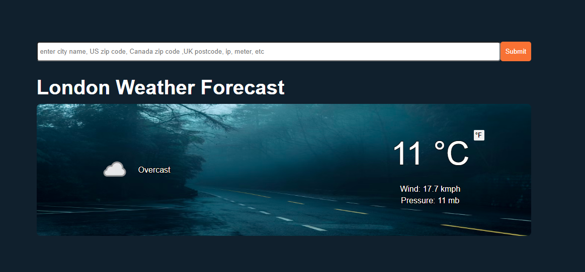

<h1 align = 'center'> Weather App</h1>



This versatile and user-friendly web tool enables you to access accurate weather information for various locations worldwide. With support for diverse search options and visually engaging features, staying updated on weather conditions has never been easier.

## Project Overview

- **Project Name**: Weather App
- **URL**: [https://khaled0p.github.io/Weather-App/](https://khaled0p.github.io/Weather-App/)

## Introduction

The Weather Web Application leverages the power of [Weather API](https://www.weatherapi.com/) to provide you with precise and up-to-date weather data. Whether you're looking for weather information for a city, country, postal code, or even an IP address, this application has you covered.

Key Features:

- Comprehensive Search: Easily find weather data for countries, cities, US Zipcodes, UK Postcodes, Canada Postal codes, IP addresses, and Latitude/Longitude coordinates.
- Dynamic Backgrounds: Experience weather updates like never before with smoothly transitioning background images that reflect the current temperature of the location you search.
- Visual Elegance: Engaging user interface with intuitive and responsive design and smooth animations.
- Accurate Data: Rely on accurate and reliable weather information sourced from [Weather API](https://www.weatherapi.com/)

Stay informed about the weather conditions for any location and enhance your user experience with dynamic backgrounds that bring the weather to life.

## Features

- Search for weather data using various options, including countries, cities, postal codes, IP addresses, and coordinates.
- Experience visually appealing background changes that correspond to the temperature of the location you search.
- Enjoy a user-friendly and elegant interface with smooth animations.
- Access precise and up-to-date weather data sourced from 'weatherapi.com.'


## Custom API Endpoints

#### Here is an example of request and response for the endpoints

 **GET** ```/London```

- Request: nothing to provide

- Response:

```json
{
    "location": {
        "name": "London",
        "region": "City of London, Greater London",
        "country": "United Kingdom",
        "lat": 51.52,
        "lon": -0.11,
        "tz_id": "Europe/London",
        "localtime_epoch": 1697486268,
        "localtime": "2023-10-16 20:57"
    },
    "current": {
        "last_updated_epoch": 1697485500,
        "last_updated": "2023-10-16 20:45",
        "temp_c": 11.0,
        "temp_f": 51.8,
        "is_day": 0,
        "condition": {
            "text": "Overcast",
            "icon": "//cdn.weatherapi.com/weather/64x64/night/122.png",
            "code": 1009
        },
        "wind_mph": 8.1,
        "wind_kph": 13.0,
        ...
    }
    ...
}
```
